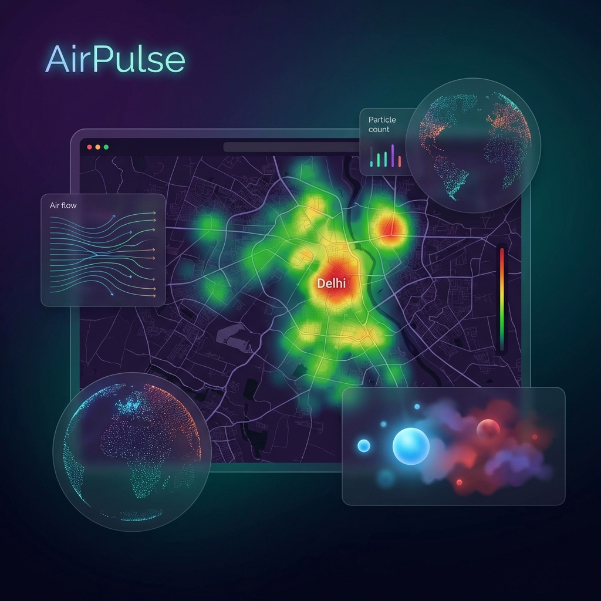

# 🌬️ AirPulse

**Hyper-local Air Quality Intelligence for a Smarter, Prettier City.**





AirPulse is a state-of-the-art air quality monitoring platform that bridges the gap between official data and citizen action. Designed specifically for the **272 wards of Delhi NCR**, it provides real-time, block-level insights to help citizens breathe better, authorities act faster, and analysts simulate a cleaner future.

---

## 🚀 Key Value Propositions

*   **📍 Precision Mapping**: Interactive choropleth maps covering every MCD ward with real-time official data fallback.
*   **🤝 Collaborative Governance**: A seamless bridge between citizens reporting pollution and authorities resolving them in real-time.
*   **🧪 Policy Simulation**: A powerful "What-If" engine to predict the impact of construction bans, traffic diversions, and weather patterns.
*   **📱 Glassmorphic Design**: A premium, mobile-responsive UI built for clarity and impact.

---

## 🎭 The Triple-Role Ecosystem

| Role | Core Capabilities | Impact |
| :--- | :--- | :--- |
| **🏙️ Citizen** | Real-time AQI, Health Advisories, Visual Pollution Reporting (Cloudinary Integration). | Empowerment & Awareness |
| **👮 Authority** | Real-time Complaint Heatmaps, Alert Broadcasting, Status Tracking. | Rapid Response & Accountability |
| **📈 Analyst** | 7-day Historical Trends, Predictive Anomaly Detection, Policy Simulation Lab. | Strategic Planning |

---

## 🛠️ Modern Tech Stack

AirPulse is built with performance and scalability in mind:

-   **Frontend**: `React 19` + `TypeScript` + `Vite` for lightning-fast interactions.
-   **Visualization**: `Leaflet` & `React-Leaflet` for geospatial rendering.
-   **Backend-as-a-Service**:
    -   **Firebase**: High-speed authentication and real-time Firestore synchronization.
    -   **Cloudinary**: optimized image hosting for complaint evidence.
-   **Data Engines**:
    -   **WAQI API**: Real-time official sensor data integration.
    -   **Turf.js**: Complex geospatial ward-to-sensor mapping.
-   **Styling**: `CSS Modules` with a focus on Glassmorphism and modern Dark Mode aesthetics.

---

## 🧬 Policy Simulation Lab

Our simulation engine uses advanced heuristics to model environmental impacts:

```math
reducedAQI = currentAQI × (1 - Σ(contribution × intervention × effectiveness))
```

Current parameters include:
-   **Traffic Load**: Up to 35% impact reduction.
-   **Construction Dust**: Up to 25% impact mitigation.
-   **Stubble/Biomass**: Strategic enforcement modelling.
-   **Weather Factors**: Wind and humidity correlation weights.

---

## 📂 Project Structure

```bash
airpulse/
├── src/
│   ├── components/
│   │   ├── dashboard/      # Interactive Map, Panels, and Charts
│   │   └── common/         # Role-based UI elements
│   ├── context/            # Global AirQualityContext (Real-time state)
│   ├── services/           # API wrappers (WAQI, Firebase, Cloudinary)
│   ├── utils/              # AQI calculation and Simulation logic
│   └── types/              # Unified TypeScript definitions
├── public/                 # GeoJSON boundaries and MCD ward metadata
└── data/                   # Simulation presets and mock fallbacks
```

---

## 📥 Getting Started

### Prerequisites
- **Node.js**: v18.x or higher
- **Firebase Account**: For Auth and Firestore
- **WAQI Token**: [Get one here](https://aqicn.org/api/)

### Installation

1.  **Clone & Install**:
    ```bash
    git clone https://github.com/MagicalMayank/AirPulse.git
    cd AirPulse/airpulse
    npm install
    ```

2.  **Environment Setup**:
    Create a `.env.local` file:
    ```env
    VITE_FIREBASE_API_KEY=your_key
    VITE_WAQI_API_TOKEN=your_token
    VITE_CLOUDINARY_CLOUD_NAME=your_name
    ```

3.  **Run Development**:
    ```bash
    npm run dev
    ```

---

## 🚧 Roadmap

- [ ] **AI-Powered Attribution**: Using ML to identify exact pollution sources from images.
- [ ] **WhatsApp Integration**: Receive ward-level alerts directly on your phone.
- [ ] **Hyper-local Forecasting**: 48-hour predictive AQI mapping using LSTM models.

---

## 📄 License & Contact

© 2026 AirPulse Initiative. Built with ❤️ for a cleaner Delhi.

**Lead Developer**: [Mayank](https://github.com/MagicalMayank)
**Project Repo**: [AirPulse](https://github.com/MagicalMayank/AirPulse)

---

> *"Every breath counts. Every data point matters."*
